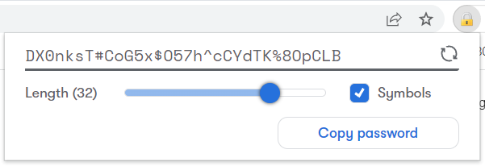

# Password Generator

A lightweight extension for generating strong and secure **passwords**, using random `crypto.getRandomValues()` **generator** tool.

Load the extension as a temporary add-on.

## Chrome installation

Open `chrome://extensions/` and enable the Developer mode, click `Load unpacked` and select the folder that contains your `manifest.json` file.
You should then see the extension's icon appear in the Chrome toolbar.

## Firefox installation

Open `about:debugging#/runtime/this-firefox` in Firefox, click `Load Temporary Add-on`, and select your `manifest.json` file.  
You should then see the extension's icon appear in the Firefox toolbar.
